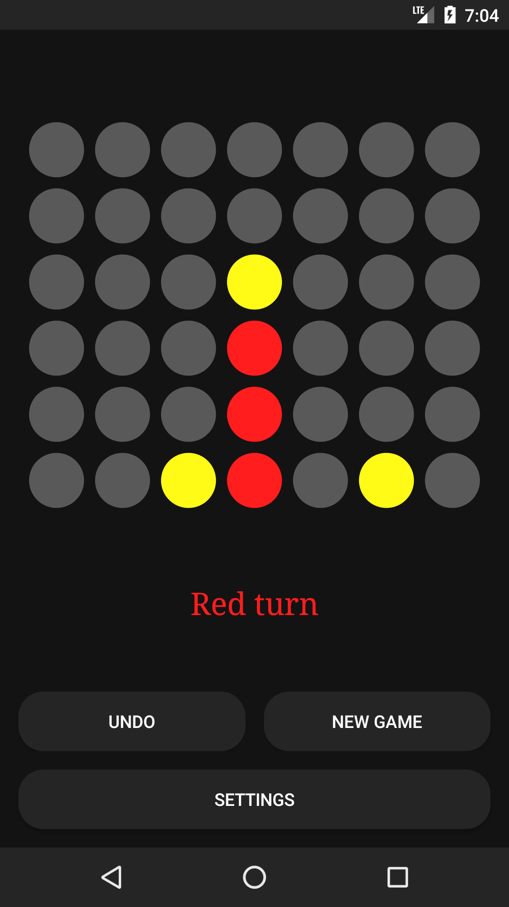
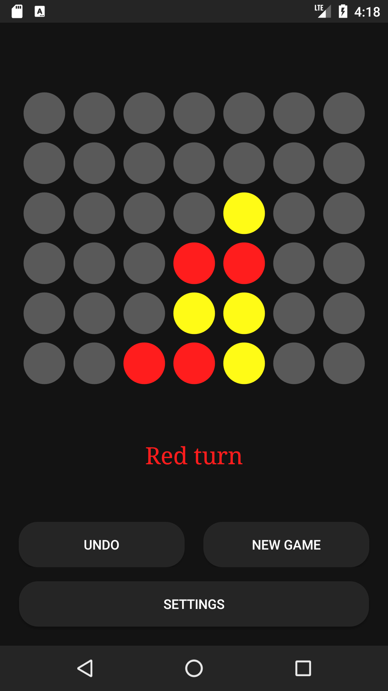

# Connect Four

A simple Connect Four game for Android, built using Java and Gradle.
The opponent AI uses a min-max algorithm.

## Features

- Standard connect four gameplay
- AI opponent with adjustable difficulty
- Undo turn functionality

## Requirements

- Android Studio to build the app
- Android device or emulator with a minimum API level of 24 (Android 7.0 Nougat)

## Building the App

This app was created using Android Studio. To build the app, simply open the project in Android
Studio and build it using the built-in tools.

## Screenshots

