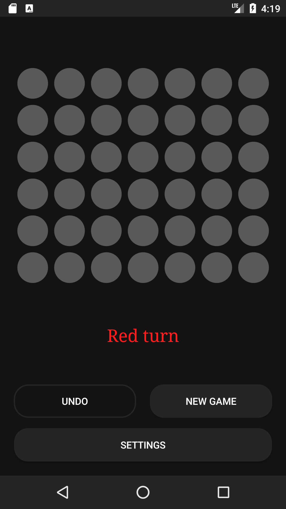

# Connect Four

A simple Connect Four game for Android, built with Java.
Both single-player and multiplayer options are available, allowing players to either play against
the AI opponent or challenge another player.

## Features

- Standard Connect Four gameplay
- AI opponent with adjustable difficulty
- Undo turn functionality

## Game Rules

Connect Four is a two-player game played on a vertical board consisting of seven columns and six
rows.
The players take turns dropping colored disks into the columns.
The disks fall to the lowest unoccupied row of the column.
The first player to connect four of their disks horizontally, vertically, or diagonally wins the
game.
If all the columns are filled and no player has connected four disks, then the game is a tie.

## AI implementation

The AI utilizes the MinMax algorithm with alpha-beta pruning and transposition table to make its
moves.
The MinMax algorithm searches the game tree recursively, evaluating the score of each possible move
until it reaches the maximum depth or a winning/losing/tie game state.
Alpha-beta pruning reduces the number of nodes that need to be evaluated
and transposition table is used to avoid repeating the same calculations for previously encountered
game states.

## Requirements

- [Android Studio](https://developer.android.com/studio) to build the app
- Android device or emulator with a minimum API level of 24 (Android 7.0 Nougat)

## Building the App

This app was created using Android Studio. To build the app, simply open the project in Android
Studio and build it using the built-in tools.

## Screenshots

|    |    |
|---------------------------------------|---------------------------------------|
|    |    |
